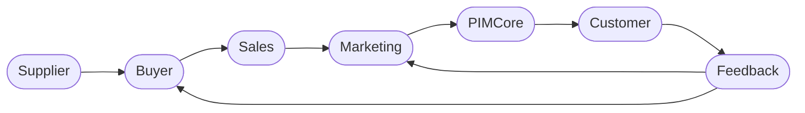

# Technical Design Document: AI-Powered B2B Music Release Intelligence Platform

**Version:** 2.0 (Production Ready)  

---

## 1. Executive Summary
This project aims to build a unified, AI-driven B2B Music Release Intelligence Platform that predicts sales, identifies target customers, recommends marketing strategies, detects high-impact trigger events, and generates visual assets. The system integrates seamlessly with the existing operational workflow: Supplier → Buyer → Sales → Marketing → PIMCore → Customer → Feedback.




The platform uses historical sales data, PIM metadata, customer insights, regional patterns, sentiment, and global industry signals to deliver high-accuracy predictions for any music product, regardless of artist, genre, region, or customer type.

The final deliverable is a closed-loop AI system that continuously learns and improves as new products, customer interactions, and feedback enter the ecosystem.

The system operates on a continuous learning cycle:
- **Input:** Product metadata & Market signals
- **Process:** Multi-model AI inference (Predictive & Generative)
- **Output:** Actionable intelligence (Forecasts, Assets, Strategy)
- **Feedback:** Actual sales & User interactions continuously retrain the models

---

## 2. High-Level Architecture
The system follows a **Lambda Architecture**, supporting both batch and real‑time processing.

### 2.1 Context Diagram (C4 Level 1)


---

## 3. Detailed Solution Architecture (Azure Native)
The platform is built for high availability, security, and MLOps maturity.

### 3.1 Component Architecture


---

## 4. Functional Modules & AI Strategy

### 4.1 Forecasting Intelligence
**Goal:** Predict unit sales & revenue for T+30, T+60, T+90.

**Algorithms:**
- XGBoost / LightGBM (main)
- Prophet / ARIMA (seasonality)

**Output:** P50/P90 forecasts.

### 4.2 B2B Customer Intelligence
- Segmentation: **K-Means**
- Propensity: **Logistic Regression**
- Recommendations: **Collaborative Filtering**

### 4.3 Generative Marketing (GenAI)
- Text: **GPT‑4o + RAG**
- Visuals: **DALL‑E 3 / SDXL** via AKS

### 4.4 Trigger Event Detection
- Model: Azure Anomaly Detector
- Logic: Alert if deviation > 2σ

---

## 5. Data Schema Design

### 5.1 Canonical Product Vector (JSON)
```json
{
  "product_id": "REL-2024-001",
  "artist_id": "ART-992",
  "genre_primary": "Techno",
  "bpm": 128,
  "release_date": "2024-06-01",
  "historical_artist_avg_sales": 15000,
  "social_momentum_score": 0.85,
  "seasonality_factor": 1.2,
  "similar_products": ["REL-2023-88", "REL-2022-12"],
  "marketing_budget_tier": "A"
}
```

### 5.2 Prediction Output
```json
{
  "prediction_id": "PRED-X772",
  "timestamp": "2024-05-01T10:00:00Z",
  "product_id": "REL-2024-001",
  "forecast": {
    "units_30d": 5000,
    "units_90d": 12500,
    "confidence_interval_low": 4800,
    "confidence_interval_high": 5200,
    "risk_level": "LOW"
  },
  "recommended_buyers": [
    { "buyer_id": "B2B-55", "propensity_score": 0.92, "reason": "High affinity for Techno" },
    { "buyer_id": "B2B-12", "propensity_score": 0.88, "reason": "Pre-ordered previous album" }
  ]
}
```

---

## 6. Integration Specifications

### 6.1 REST API Endpoints
| Method | Endpoint | Description |
|--------|----------|-------------|
| POST | /v1/forecast/predict | Run live inference |
| GET | /v1/marketing/assets/{id} | Get generated marketing assets |
| POST | /v1/feedback/sales | Submit actual sales for retraining |
| GET | /v1/triggers/alerts | Get active market alerts |

### 6.2 PIMCore Integration Workflow
- PIM → Webhook → Azure Logic App → AI Forecast → Writeback PIM fields.

---

## 7. Operational Workflows

### 7.1 Continuous Learning Loop


---

## 8. Security & Compliance
- Entra ID RBAC
- AES‑256 encryption
- TLS 1.2+ in transit
- Private Link networking
- Secrets stored in Key Vault

---

## 9. Deployment Strategy

### 9.1 IaC
Terraform or Bicep-managed Azure resources.

### 9.2 Model Deployment (Blue/Green)
```mermaid
graph LR
    Dev -->|Push| Git
    Git -->|CI/CD| Action

    subgraph Deployment Pipeline
        Action -->|Terraform Plan| TF
        TF -->|Apply| Infra
        Action -->|Train| AML
        AML -->|Register| Model
        Model -->|Deploy| Endpoint
    end
